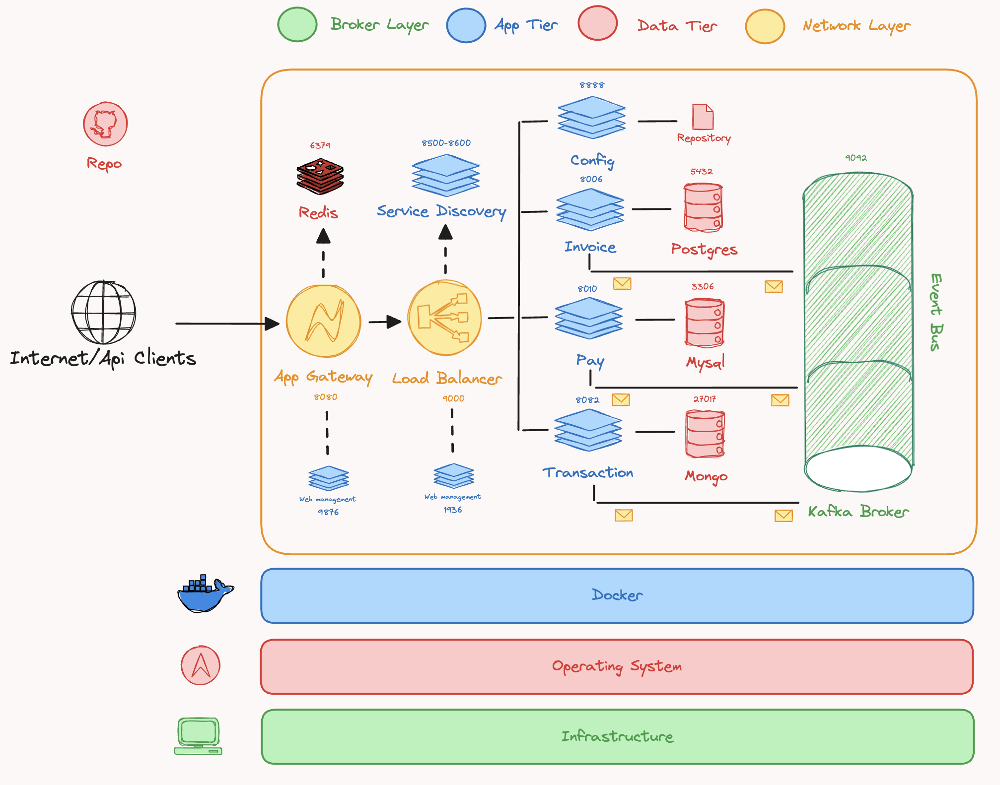

# Spring Boot Payment Microservices Application 🚀



## Technologies

- Spring Boot (Java Framework JDK v11+)
- Gradle (Dependency Management)
- Postman (Endpoints Testing)
- Postgresql (Relational Database)
- MySQL (Relational Database)
- MongoDB (Non-Relational Database)
- Kafka (Message Broker)
- Github (Project Repository)

## Getting Started

Take into account that you need to have installed the following tools:

- Docker
- Docker Compose

1. Execute the following command to start the microservices:

```bash
./scripts/deploy.sh
```

2. Creation of app gateway user and credentials

```bash
docker exec -it express-gateway sh
./scripts/users.sh
```

## Microservices Information

The **invoices microservice** must list customer invoices and must also consume a queue to change the status of the invoice when it is paid through the payment microservice.

The **payment microservice** must register the payment in its respective database and must also leave a message in a queue to update the invoice in the invoice microservice and must also leave a message in a queue to register the movement in the transaction microservice.

The **transaction microservice** must list the transactions of an invoice, and must also consume a queue to obtain the payment transactions from the payment microservice.

The **configuration microservice** must provide the configuration for all microservices also the most important action is that it provides consul address for service discovery registration.  

All microservices must consume the connection string from the centralized configuration service. Information about the endpoints available per microservice is included in the INFO.md document.


## Storage 📜

### PostgreSQL

The PostgreSQL database is used to store the invoices and transactions data and is accessed by the invoices and transactions microservices.

### MySQL

The MySQL database is used to store the payment data and is accessed by the payment microservice.

### MongoDB

The MongoDB database is used to store the transaction data and is accessed by the transaction microservice.

## Networking

### Application Gateway

The application gateway is a reverse proxy that provides a single point of entry for all incoming traffic to the microservices application. It routes requests to the appropriate microservices based on the request URL path. This app gateway is implemented using HAProxy and is configured to use Consul for service discovery and has a redis cache for session management.

### Consul

Consul is a distributed service mesh to connect, secure, and configure services across any runtime platform and public or private cloud. It provides service discovery, health checking, key-value store, and multi-datacenter features.

### HAProxy

This HAProxy configuration is designed to serve as a reverse proxy for HTTP traffic, routing requests based on the URL path to different backend services discovered dynamically using Consul service discovery. It provides timeout settings, load balancing, health checks, and dynamic resolution of backend server addresses.

#### Defaults

The default configuration specifies the following timeout settings:

- timeout connect: Sets the timeout for establishing a connection to the backend server to 5 seconds.
- timeout client: Sets the timeout for the client connection to 1 minute.
- timeout server: Sets the timeout for the server connection to 1 minute.

#### Frontend 

1. Stats

    - Bind: Listens on port 1936 on all interfaces (*:1936).
    - Mode: Configured for HTTP traffic.
    - Stats URI: Exposes HAProxy statistics at the root URI ("/").
    - Show Legends: Displays legends for the statistics.
    - Logging: No logging is enabled for this frontend.

2. http_front

    - Bind: Listens on port 80 on all interfaces (*:80).
    - Mode: Configured for HTTP traffic.
    - ACLs: Defines ACLs based on path for routing to specific backends.
    - url_app-config: Routes requests starting with "/app-config" to the app-config-backend.
    - url_app-invoice: Routes requests starting with "/app-invoice" to the app-invoice-backend.
    - url_app-pay: Routes requests starting with "/app-pay" to the app-pay-backend.
    - url_app-transaction: Routes requests starting with "/app-transaction" to the app-transaction-backend.
    - Backend Usage: Routes requests to appropriate backends based on ACLs.

#### Backend

- Services: app-config-backend, app-invoice-backend, app-pay-backend, app-transaction-backend
- Mode: Configured for HTTP traffic.
- Balance Algorithm: Uses round-robin load balancing algorithm.
- Path Manipulation: Modifies the request path using http-request set-path.
- Server Configuration: Specifies backend servers with their respective service names and ports.
- Resolvers: Utilizes the consul resolver to resolve backend server addresses dynamically from Consul service discovery.
- Health Checks: Performs health checks on backend servers using check parameter.
- IPv4 Resolution Preference: Specifies IPv4 resolution preference using resolve-prefer ipv4.

#### Resolvers

- Nameserver: Specifies the Consul DNS server address (consul:8600).
- Accepted Payload Size: Sets the maximum payload size accepted from Consul DNS responses.
- Hold Valid: Specifies the validity duration for cached DNS responses as 5 seconds.

## Evidency

### Dnsmasq


### Application Gateway


## HAProxy


## Consul


## Config


## Services


