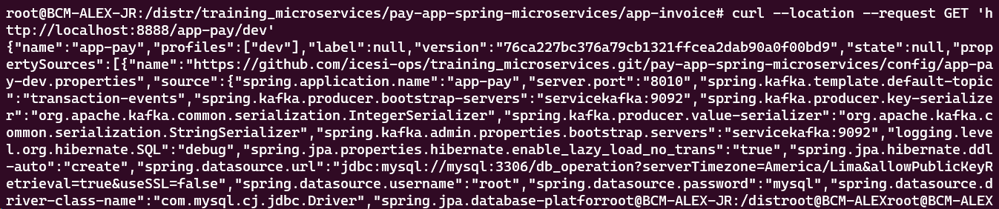
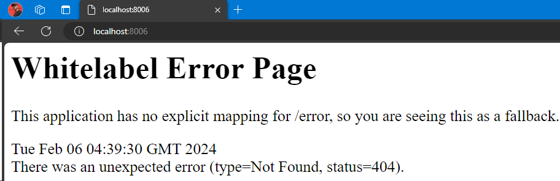

# Configuration
## 1. Network creation
```bash
docker network create distribuidos
```
## 2. Database creation
- Postgres
```bash
docker run -p 5434:5432  --name postgres --network distribuidos -e POSTGRES_PASSWORD=postgres -e  POSTGRES_DB=db_invoice -d postgres:12-alpine
```
## 3. Kafka creation
```bash
docker run -p 2181:2181 -d -p 9092:9092 --name servicekafka --network distribuidos -e ADVERTISED_HOST=servicekafka -e NUM_PARTITIONS=3 johnnypark/kafka-zookeeper
```
## 4. Running app-config service
### 4.1. Dockerfile modification
```Dockerfile
FROM openjdk:13-alpine as stage1
COPY . /app
WORKDIR /app
RUN chmod 777 gradlew
RUN ./gradlew clean
RUN ./gradlew bootJar


FROM openjdk:13-alpine
EXPOSE 8888
COPY --from=stage1 /app/build/libs/app-config-1.0.0.jar app-config.jar
#ADD ./build/libs/app-config-1.0.0.jar app-config.jar
ENTRYPOINT ["java", "-jar", "/app-config.jar"]
```
### 4.2. Build
```bash
docker build -t alexjr2002/app-config .
```
### 4.3. Run
```bash
docker run -p 8888:8888 --name app-config --network distribuidos -d alexjr2002/app-config
```
### 4.4. Working proof

## 5. Running app-invoice service
### 5.1. Dockerfile modification
```Dockerfile
FROM openjdk:13-alpine as stage1
COPY . /app
WORKDIR /app
RUN chmod 777 gradlew
RUN ./gradlew clean
RUN ./gradlew bootJar


FROM openjdk:13-alpine
EXPOSE 8006
COPY --from=stage1 /app/build/libs/app-invoice-1.0.0.jar app-invoice.jar
#ADD ./build/libs/app-config-1.0.0.jar app-config.jar
ENTRYPOINT ["java", "-jar", "/app-invoice.jar"]
```
### 5.2. Build
```bash
docker build -t alexjr2002/app-invoice .
```
### 5.3. Run
```bash
docker run -p 8006:8006 --name app-invoice --network distribuidos -d alexjr2002/app-invoice
```
### 5.4. Working proof

